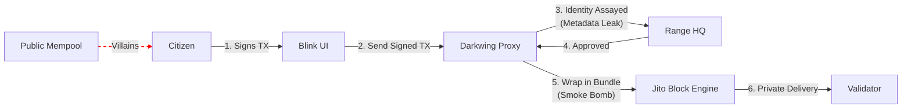

# 🦆 DarkwingDucks: Let's get ZKangerous!

> **"The terror that flaps in the mempool."**
> The first meme-powered Dark Pool for Solana Retail.

## 🚨 The Villain: Dr. Sandwich
Retail users lost **$450M+** to MEV bots (sandwich attacks) in 2025.
You need a hero. Not a boring mixer, but a **Masked Vigilante**.

## 🦸 The Solution: DarkwingDucks
We provide an **Instant Dark Pool** layer for Solana Blinks.
We wrap your transaction in a "Smoke Bomb" (Jito Bundle) and route it through a secret tunnel, bypassing public mempool villains entirely.

### 🦆 The "Privacy Pond" Philosophy
> **"Browsing? Use DuckDuckGo. Trading? Use DarkwingDucks."**

We follow the **DDG Standard**:
* **DuckDuckGo** stops Google from tracking your clicks.
* **DarkwingDucks** stops MEV Bots from tracking your swaps.
* *Same pond. Same mission. Different villains.*

## 🏗️ Architecture (Trust-Minimized Pipeline)

We utilize a split-knowledge pipeline to ensure compliance without compromising intent privacy.

*   **Range Protocol** receives only wallet identity (metadata).
*   **Arcium/Jito** processes encrypted intent (asset protection).
*   **Proxy** (Darkwing) wraps the **already signed** user transaction; it cannot modify it (no custody).

### ⚖️ The "Testum" Standard (Compliance)
> **"We leak metadata (Who) to protect the asset (What)."**

Range Protocol acts as our assaying vessel. It knows *who* is transacting (to check against OFAC list), but the public mempool does not know *what* you are trading until it's too late for them to attack.

1.  **The Vessel**: Range Protocol acts as our assaying vessel.
2.  **The Process**: Every wallet is tested for OFAC sanctions and AML risks.
3.  **The Result**: Only "Pure Gold" transactions are wrapped in Jito Bundles.

## 🔌 API & Integration

**Blinks** talk to our Rust backend via `POST /api/protect`. The Blink sends a **signed** transaction payload (Base64), and the server wraps it into a bundle without needing the user's private key.

## 🏆 Integrations
*   **Anoncoin**: Instant Dark Pool infrastructure.
*   **Range**: `screen_wallet` for AML compliance.
*   **Helius**: High-speed DAS & RPC.