Markdown

# 🦆 DarkwingDucks: Let's get ZKangerous!

> **"The terror that flaps in the mempool."**
> The first meme-powered Dark Pool for Solana Retail.

[](https://solana.com)
[](https://twitter.com)
[](https://github.com)

## 🚨 The Villain: Dr. Sandwich (Toxic MEV)
Retail users lost **$450M+** to MEV bots (sandwich attacks) in 2025.
Even as general network tips decline, **Toxic MEV** remains a predator for retail traders.

### ⚖️ The "Crying Juror" Reality (Why Law Failed)
**Case Study (Nov 2025):** In the *US v. Peraire-Bueno* MEV fraud case, the federal jury deadlocked in a mistrial. Jurors were reportedly "crying" and having "sleepless nights," unable to decide if MEV is a crime or a strategy.

**The Lesson:** The legal system is confused and slow.
**The Solution:** You cannot wait for a court verdict. You need **DarkwingDucks** to make your transactions invisible to predators *today*.

## 🔌 API & Integration

**Blinks** talk to our Rust backend via `POST /api/protect`. The Blink sends a **signed** transaction payload (Base64).

## 🔑 First-Time Setup (Demo Mode)

1. **Start the server** (Generates relayer wallet):
   ```bash
   cargo run --bin server
   ```

2. **Fund the relayer** (Address printed in console):
   ```bash
   solana transfer <RELAYER_PUBKEY> 0.1 --url mainnet-beta
   ```
   *Note: This wallet needs SOL to pay Jito bundle tips.*

3. **Rest Easy**: The server now handles the rest.

## 🏆 Integrations

## 🦸 The Solution: DarkwingDucks
We provide an **Instant Dark Pool** layer for Solana Blinks.
We wrap your transaction in a "Smoke Bomb" (Jito Bundle) and route it through a secret tunnel, bypassing public mempool villains entirely.

> **Note on MEV:** DarkwingDucks eliminates **Sandwich Attacks** and **Front-Running**.
> We cannot stop arbitrage (back-running), but we make sure YOU are not the victim of predatory pricing.

### 🦆 The "Privacy Pond" Philosophy
> **"Browsing? Use DuckDuckGo. Trading? Use DarkwingDucks."**

We follow the **DDG Standard**:
* **DuckDuckGo** stops Google from tracking your clicks.
* **DarkwingDucks** stops MEV Bots from tracking your swaps.
* *Same pond. Same mission. Different villains.*

## 🏗️ Architecture

```mermaid
graph LR
    User[Citizen] -->|1. Identity Check<br/>⚠️ LEAK: Wallet ID| Range["Range HQ (Testum)"];
    Range -->|2. Clear| Arcium[Secret Encoder];
    Arcium -->|3. Smoke Bomb| Jito[Jito Tunnel];
    Jito -->|4. Private Delivery| Validator;
    Mempool[Public Mempool] -.->|Villains| User;
    linkStyle 0 stroke:orange,stroke-width:2px;
    linkStyle 4 stroke:red,stroke-width:2px,stroke-dasharray: 5 5;
```



### ⚖️ The "Testum" Standard (Compliance)
The Old Saying (The Duck Test): "If it looks like a duck, and swims like a duck, it's a duck."

The Darkwing Standard: We don't judge by feathers. We judge by metal.

Etymology Fact: The word "Test" comes from the Latin testum — an earthen pot used by alchemists to assay (determine the purity of) gold.

DarkwingDucks rejects the superficial "Duck Test". Instead, we use the Testum Method:

The Vessel: Range Protocol acts as our assaying vessel.

The Process: Every wallet is tested for OFAC sanctions and AML risks.

The Result: Only "Pure Gold" transactions are wrapped in Jito Bundles. Slag is discarded.

We prove that privacy and compliance can swim in the same pond.

🏆 Alliance Members
Anoncoin ($10k): We are the literal Dark Pool infra for your memecoins.

Range ($1.5k): Our "Testum" ensures only pure gold enters the pool.

Helius ($5k): Our turbo-charged motorbike (RPC).

⚠️ Legal Disclaimer (Parody & Non-Affiliation)
DarkwingDucks is an experimental, non-commercial privacy protocol and a parody commentary on "Dark Pools".

Not Affiliated: We are NOT affiliated, associated, authorized, endorsed by, or in any way officially connected with The Walt Disney Company (Darkwing Duck) OR DuckDuckGo Inc. We just really like ducks and privacy.

Parody: This project is a commentary on the "sitting duck" nature of retail traders.

Terminology:

"Darkwing" = Speed of Dark Pool execution.

"Ducks" = Retail users ("Sitting Ducks") needing protection.

No Copyrighted Art: No original assets are used. All visuals are custom/abstract.

Zero Ducks Given about MEV. 100% Compliance Given about Laws.